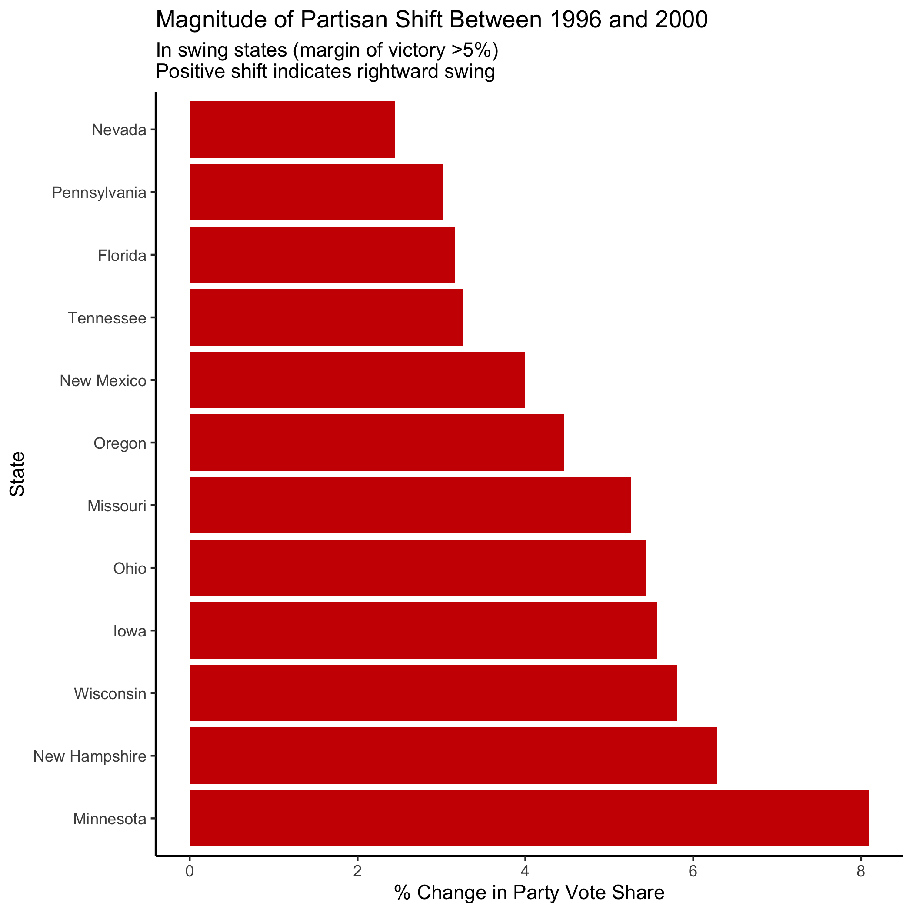
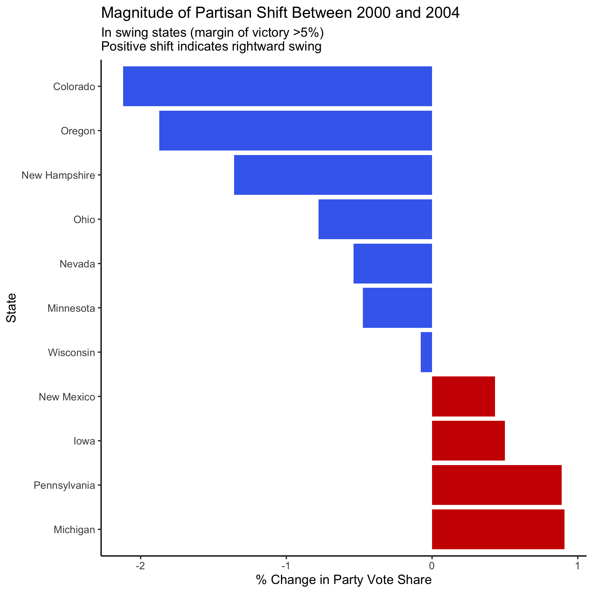
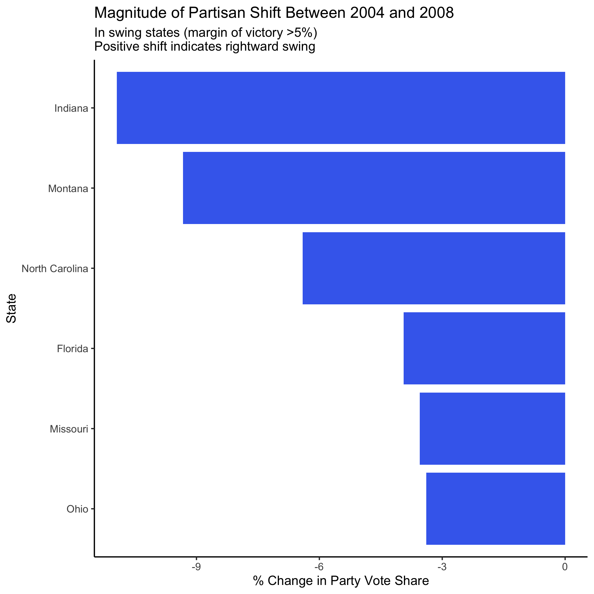
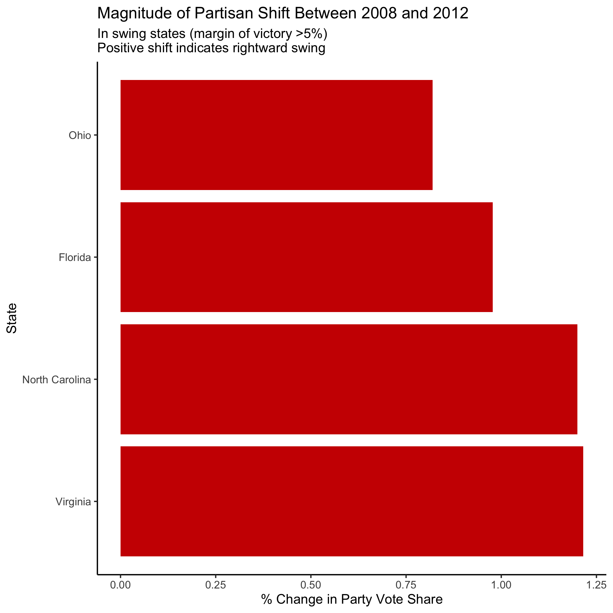
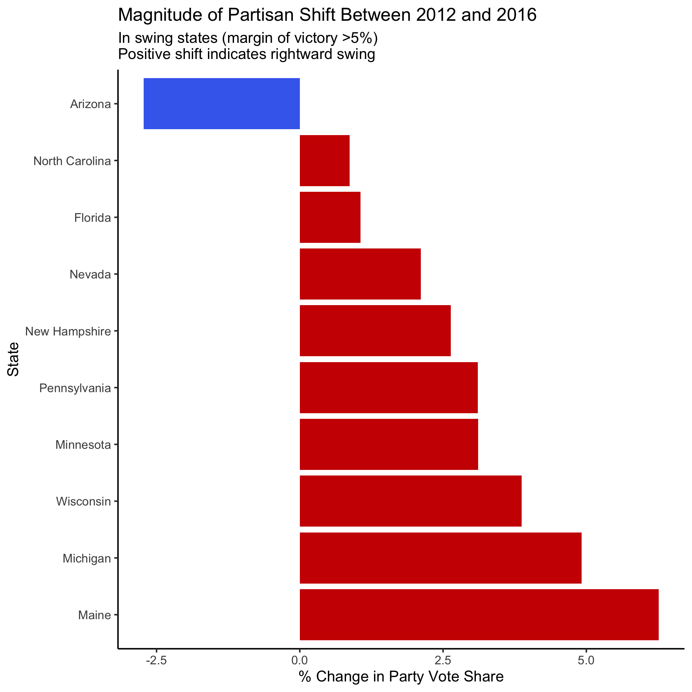

Bush's First Election            |  Bush's Second Election
:-------------------------:|:-------------------------:
   |  


Obama's First Election            |  Obama's Second Election
:-------------------------:|:-------------------------:
   |  


| Trump's Election   |  
:-------------------------:|
| |  


```{r setup, include=FALSE}
knitr::opts_chunk$set(echo = TRUE)

library(tidyverse)
library(usmap)
library(ggplot2)

# Read in data
popvote <- read_csv("data/popvote_1948-2016.csv")
pvstate_df <- read_csv("data/popvote_bystate_1948-2016.csv")

# Load US map
states_map <- usmap::us_map()
unique(states_map$abbr)

# sample theme CUSTOMIZE LATER
my_pretty_theme <- theme_bw() + 
    theme(panel.border = element_blank(),
          plot.title   = element_text(size = 15, hjust = 0.5), 
          axis.text.x  = element_text(angle = 45, hjust = 1),
          axis.text    = element_text(size = 12),
          strip.text   = element_text(size = 18),
          axis.line    = element_line(colour = "black"),
          legend.position = "top",
          legend.text = element_text(size = 12))


```


```{r creating swing datasets}
# creating data sets with swing margin, win margin, and factor variable coding swing (<5) or not

# 2016
pvstate_2016 <- pvstate_df %>%
  filter(year == 2012 | year == 2016) %>%
  group_by(state) %>%
  arrange(year, .by_group = TRUE) %>%
  select(-total, -D, -R) %>%
  pivot_wider(names_from = year, values_from = c(D_pv2p, R_pv2p)) %>%
  mutate(swing = R_pv2p_2016 - R_pv2p_2012,
         margin = R_pv2p_2016 - D_pv2p_2016) %>%
  mutate(is_swing = case_when(abs(margin) < 5 ~ TRUE,
                              TRUE ~ FALSE),
         swing_dir = case_when(swing > 0 ~ "R",
                               TRUE ~ "D"))

# 2012
pvstate_2012 <- pvstate_df %>%
  filter(year == 2008 | year == 2012) %>%
  group_by(state) %>%
  arrange(year, .by_group = TRUE) %>%
  select(-total, -D, -R) %>%
  pivot_wider(names_from = year, values_from = c(D_pv2p, R_pv2p)) %>%
  mutate(swing = R_pv2p_2012 - R_pv2p_2008,
         margin = R_pv2p_2012 - D_pv2p_2012) %>%
  mutate(is_swing = case_when(abs(margin) < 5 ~ TRUE,
                              TRUE ~ FALSE),
         swing_dir = case_when(swing > 0 ~ "R",
                               TRUE ~ "D"))

# 2008
pvstate_2008 <- pvstate_df %>%
  filter(year == 2004 | year == 2008) %>%
  group_by(state) %>%
  arrange(year, .by_group = TRUE) %>%
  select(-total, -D, -R) %>%
  pivot_wider(names_from = year, values_from = c(D_pv2p, R_pv2p)) %>%
  mutate(swing = R_pv2p_2008 - R_pv2p_2004,
         margin = R_pv2p_2008 - D_pv2p_2008) %>%
  mutate(is_swing = case_when(abs(margin) < 5 ~ TRUE,
                              TRUE ~ FALSE),
         swing_dir = case_when(swing > 0 ~ "R",
                               TRUE ~ "D"))

# 2004
pvstate_2004 <- pvstate_df %>%
  filter(year == 2000 | year == 2004) %>%
  group_by(state) %>%
  arrange(year, .by_group = TRUE) %>%
  select(-total, -D, -R) %>%
  pivot_wider(names_from = year, values_from = c(D_pv2p, R_pv2p)) %>%
  mutate(swing = R_pv2p_2004 - R_pv2p_2000,
         margin = R_pv2p_2004 - D_pv2p_2004) %>%
  mutate(is_swing = case_when(abs(margin) < 5 ~ TRUE,
                              TRUE ~ FALSE),
         swing_dir = case_when(swing > 0 ~ "R",
                               TRUE ~ "D"))

# 2000
pvstate_2004 <- pvstate_df %>%
  filter(year == 2000 | year == 1996) %>%
  group_by(state) %>%
  arrange(year, .by_group = TRUE) %>%
  select(-total, -D, -R) %>%
  pivot_wider(names_from = year, values_from = c(D_pv2p, R_pv2p)) %>%
  mutate(swing = R_pv2p_2000 - R_pv2p_1996,
         margin = R_pv2p_2000 - D_pv2p_2000) %>%
  mutate(is_swing = case_when(abs(margin) < 5 ~ TRUE,
                              TRUE ~ FALSE),
         swing_dir = case_when(swing > 0 ~ "R",
                               TRUE ~ "D"))


```


```{r creating swing column graphs}

# 2016 swing column graph

swing_16_col <- pvstate_2016 %>%
  filter(is_swing == TRUE) %>%
  ggplot(aes(swing, fct_reorder(state, swing, .desc = TRUE), fill = swing_dir)) +
  geom_col() +
  scale_fill_manual(values = c("royalblue2", "red3")) + 
  theme_classic() +
  labs(x = "% Change in Party Vote Share",
       y = "State",
       title = "Magnitude of Partisan Shift Between 2012 and 2016",
       subtitle = "In swing states (margin of victory >5%)\nPositive shift indicates rightward swing") + 
  theme(legend.position = "none")

# 2012 swing column graph

swing_12_col <- pvstate_2012 %>%
  filter(is_swing == TRUE) %>%
  ggplot(aes(swing, fct_reorder(state, swing, .desc = TRUE), fill = swing_dir)) +
  geom_col() +
  scale_fill_manual(values = c("red3")) + 
  theme_classic() +
  labs(x = "% Change in Party Vote Share",
       y = "State",
       title = "Magnitude of Partisan Shift Between 2008 and 2012",
       subtitle = "In swing states (margin of victory >5%)\nPositive shift indicates rightward swing") + 
  theme(legend.position = "none")


# 2008 swing column graph

swing_08_col <- pvstate_2008 %>%
  filter(is_swing == TRUE) %>%
  ggplot(aes(swing, fct_reorder(state, swing, .desc = TRUE), fill = swing_dir)) +
  geom_col() +
  scale_fill_manual(values = c("royalblue2")) + 
  theme_classic() +
  labs(x = "% Change in Party Vote Share",
       y = "State",
       title = "Magnitude of Partisan Shift Between 2004 and 2008",
       subtitle = "In swing states (margin of victory >5%)\nPositive shift indicates rightward swing") + 
  theme(legend.position = "none")

# 2004 swing column graph

swing_04_col <- pvstate_2004 %>%
  filter(is_swing == TRUE) %>%
  ggplot(aes(swing, fct_reorder(state, swing, .desc = TRUE), fill = swing_dir)) +
  geom_col() +
  scale_fill_manual(values = c("royalblue2", "red3")) + 
  theme_classic() +
  labs(x = "% Change in Party Vote Share",
       y = "State",
       title = "Magnitude of Partisan Shift Between 2000 and 2004",
       subtitle = "In swing states (margin of victory >5%)\nPositive shift indicates rightward swing") + 
  theme(legend.position = "none")


swing_00_col <- pvstate_2000 %>%
  filter(is_swing == TRUE) %>%
  ggplot(aes(swing, fct_reorder(state, swing, .desc = TRUE), fill = swing_dir)) +
  geom_col() +
  scale_fill_manual(values = c("red3")) + 
  theme_classic() +
  labs(x = "% Change in Party Vote Share",
       y = "State",
       title = "Magnitude of Partisan Shift Between 2008 and 2012",
       subtitle = "In swing states (margin of victory >5%)\nPositive shift indicates rightward swing") + 
  theme(legend.position = "none")

swing_08_col
swing_04_col
swing_00_col
```


```{r}

# class plot
pv_national_historical <- ggplot(popvote, aes(x = year, y = pv2p, colour = party)) +
    geom_line(stat = "identity") +
    scale_color_manual(values = c("blue", "red"), name = "") +
    xlab("") + ## no need to label an obvious axis
    ylab("popular vote %") +
    ggtitle("Presidential Vote Share (1948-2016)") + 
    scale_x_continuous(breaks = seq(from = 1948, to = 2016, by = 4)) +
    my_pretty_theme

pv_national_historical

ggsave("figures/PV_national_historical.png")

```

```{r margins map}
## read in state pop vote
pvstate_df <- read_csv("data/popvote_bystate_1948-2016.csv")

## shapefile of states from `usmap` library
states_map <- usmap::us_map()
head(states_map)

## map: GOP pv2p (`plot_usmap` is wrapper function of `ggplot`)
## note: `usmap` merges this internally, but other packages may not!

gop_voteshare <- plot_usmap(data = pvstate_df %>% filter(year == 2000), regions = "states", labels = TRUE, values = "R_pv2p") + 
  scale_fill_gradient(low = "white", high = "red", name = "GOP two-party voteshare") +
  theme_void()

gop_voteshare


```


```{r state winner plot}
## map: wins
pv_win_map <- pvstate_df %>%
    filter(year == 2000) %>%
    mutate(winner = ifelse(R > D, "republican", "democrat"))

pv_win_plot <- plot_usmap(data = pv_win_map, regions = "states", values = "winner") +
    scale_fill_manual(values = c("blue", "red"), name = "state PV winner") +
    theme_void()

pv_win_plot

ggsave("figures/pv_win_plot_2000.png")
```


```{r margins map}
## map: win-margins
pv_margins_map <- pvstate_df %>%
    filter(year == 2000) %>%
    mutate(win_margin = (R_pv2p-D_pv2p))

plot_usmap(data = pv_margins_map, regions = "states", values = "win_margin") +
    scale_fill_gradient2(
      high = "red3", 
      #mid = scales::muted("purple"), ##TODO: purple or white better?
      mid = "white",
      low = "royalblue2", 
      breaks = c(-50,-10,0,10,50), 
      limits = c(-50,50),
      name = "win margin"
    ) +
    theme_void()

pv_margins_map

ggsave("figures/PV_margins_map.png")
```


```{r map grid}
## map grid
pv_map_grid <- pvstate_df %>%
    filter(year >= 2000) %>%
    mutate(winner = ifelse(R > D, "republican", "democrat"))

pv_states_historical <- plot_usmap(data = pv_map_grid, regions = "states", values = "winner", color = "white") +
    facet_wrap(facets = year ~.) + ## specify a grid by year
    scale_fill_manual(values = c("royalblue2", "red3"), name = "PV winner") +
    theme_void() +
    theme(strip.text = element_text(size = 12),
          aspect.ratio = 1)

pv_states_historical

ggsave("figures/PV_states_historical.png", height = 3, width = 8)


```
