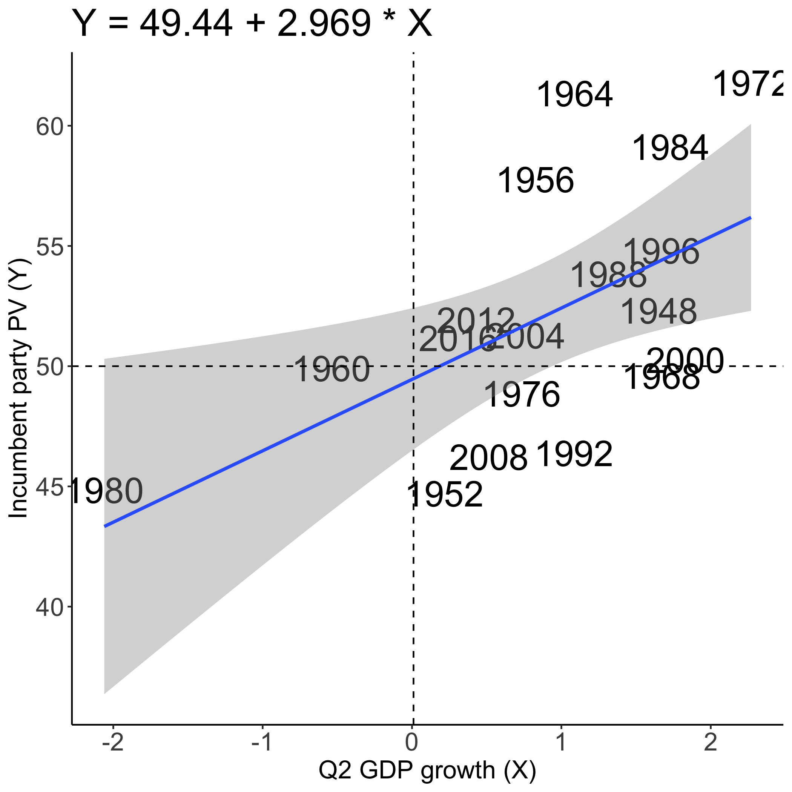
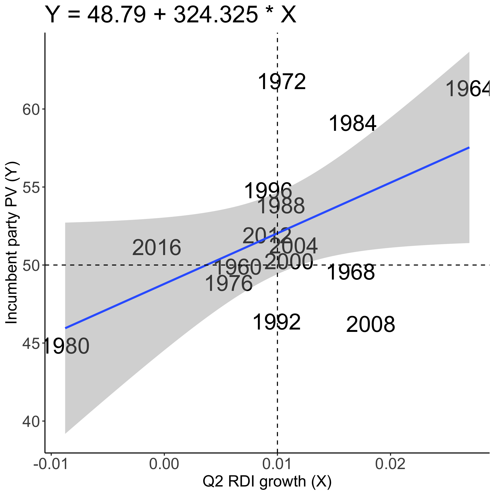
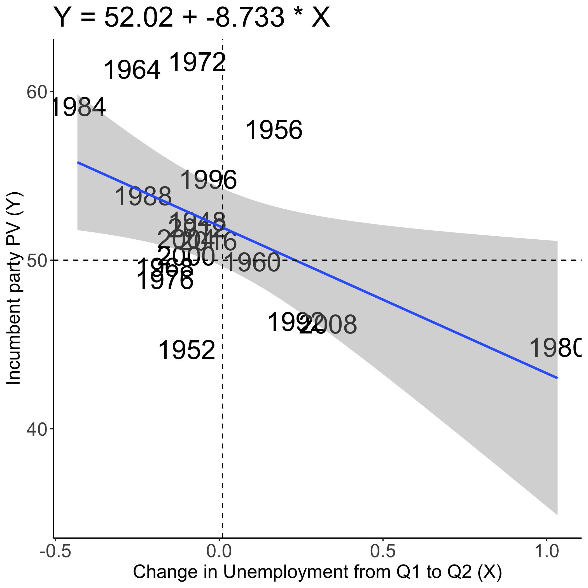

# Economy
## September18, 2020

**_"It's the economy, stupid."_**

Bill Clinton’s campaign manager, James Carville, famously [coined this phrase](https://www.cnn.com/2020/05/08/opinions/economy-2020-election-trump-biden-zelizer/index.html) leading up to the 1992 presidential election. Candidate Clinton’s campaign played up the early 90s recession in order to unseat successfully incumbent president George H. W. Bush. This quip only dates back to 1992, but the general wisdom that the economy plays a major role in election outcomes is probably about as old as democracy itself.

But “the economy” is a big concept. It includes indicators like stock market performance or annual gross domestic product (GDP) that measure the health of the national economy. It also includes things like real disposable income (RDI) or local unemployment rates that reveal less about national-level economic health but paint a clearer picture of the state of voters’ pocketbooks. While each measure is certainly related to the others, they tell slightly different stories about election outcomes. Here, we’ll assess the relationship between a variety of different economic indicators and past election outcomes, and what the data suggest about the upcoming 2020 presidential election.

### Methodology and Terms
For these purposes, we’ll focus on economic indicators from the second fiscal quarter of presidential election years. Research suggests that voters weigh the year or few months leading up to an election more heavily than the rest of an incumbent’s term in office. [(Healy and Lenz, 2014)](https://hollis.harvard.edu/primo-explore/fulldisplay?docid=TN_cdi_gale_infotracacademiconefile_A354446646&context=PC&vid=HVD2&search_scope=everything&tab=everything&lang=en_US)

We’ll build predictive models around three variables to identify how they impact the popular vote share of incumbent political parties:
- Second quarter GDP growth
- Second quarter RDI growth
- The change in the unemployment rate between Q1 and Q2

If it is true that voters consider each of these indicators at the ballot box, stronger economic performance (i.e. higher GDP and RDI growth and larger decreases in unemployment rates) would track with higher popular vote shares for incumbents.

In order to evaluate the performance of each model, we’ll consider the following tests:
- **R-squared value:** This is a measure of how much variance in a data set is explained by the model. The R-squared value evaluates the _in-sample fit_ of the model, namely how well the model fits the data it is based on. Formula: R^2 = 1 - (unexplained variance / total variance in data set)
- **Leave-one-out validation:** Leave-one-out validation builds a model around all but one of its original sample and evaluates the difference between the predicted value and the actual value. This helps approximate the _out-of-sample fit_ of the model, namely how well it fits data sets it is not based on.

### Q2 GDP Growth

| Impact of Q2 GDP Growth on Incumbent Party Vote Share   |  
:-------------------------:|
| |  

_Takeaways:_
- **Effect:** Based on data from every presidential election since 1976, the average effect of every additional point of Q2 GDP growth, is a 2.969 point increase in the incumbent party’s popular vote share. 
- **R-squared:** The model’s R-squared value is 0.326, meaning the model explains about 32.6% of the variation in the actual dataset
- **Leave-one-out results:** Modelling off of data excluding the 2016 presidential election yielded a prediction of the incumbent party’s popular vote share that was 0.0849 points less than the actual result.

**This model predicts that Donald Trump will win 21.26% of the popular vote** based on Q2 GDP growth, which hit a [historic low](https://www.washingtonpost.com/business/2020/07/30/gdp-q2-coronavirus/). This result is highly mismatched with [current polling](https://www.npr.org/2020/09/18/914103948/poll-biden-maintains-lead-over-trump) in which Biden leads Trump 52% to 43%. 

### Q2 RDI Growth

| Impact of Q2 Real Disposable Income (RDI) Growth on Incumbent Party Vote Share   |  
:-------------------------:|
| |  

_Takeaways:_
- **Effect:** Based on data from every presidential election since 1976, the average effect of every additional point of Q2 RDI growth, is a 324 point increase in the incumbent party’s popular vote share (Quarter-by-quarter RDI growth is typically very very low. A one-point increase would be fairly astronomical.)
- **R-squared:** The model’s R-squared value is 0.258, meaning the model explains about 25.8% of the variation in the actual dataset
- **Leave-one-out results:** Modelling off of data excluding the 2016 presidential election yielded a prediction of the incumbent party’s popular vote share that was 3.19 points less than the actual result.

**This model predicts that Donald Trump will win 80.33% of the popular vote** based on Q2 RDI growth. This result is also highly mismatched and RDI growth, which was much higher in Q2 than normal, might have been [distorted](https://www.bea.gov/news/2020/gross-domestic-product-2nd-quarter-2020-advance-estimate-and-annual-update) by economic stimulus programs in response to COVID-19. It is unlikely to be especially representative of most Americans' financial situations during the pandemic.

### Q2 Unemployment Rate Change

| Impact of Change in Q2 vs Q1 Unemployment Rate on Incumbent Party Vote Share |  
:-------------------------:|
| |  

_Takeaways:_
- **Effect:** Based on data from every presidential election since 1976, the average effect of a one-point increase in the unemployment rate between Q1 and Q2, is an 8.185 point decrease in the incumbent party’s popular vote share. 
- **R-squared:** The model’s R-squared value is 0.272, meaning the model explains about 27.2% of the variation in the actual dataset
- **Leave-one-out results:** Modelling off of data excluding the 2016 presidential election yielded a prediction of the incumbent party’s popular vote share that was 1.220 points greater than the actual result.

**This model predicts that Donald Trump will win a mathematically impossible -28.32% of popular vote.** Unemployment rates skyrocketed from just under 4% to around 13% (and counting) between Q1 and Q2 of 2020 due to COVID-19, a historic increase.

### Conclusions

While data from past elections demonstrates that there is some relationship between economic performance and incumbent performance, model predictions for 2020 indicate that 1) the economy isn't everything, and 2) different economic indicators can tell different stories. Pandemic conditions wildly distort economic conditions and may lead voters to different conclusions about the incumbent's culpability for national performance. 

