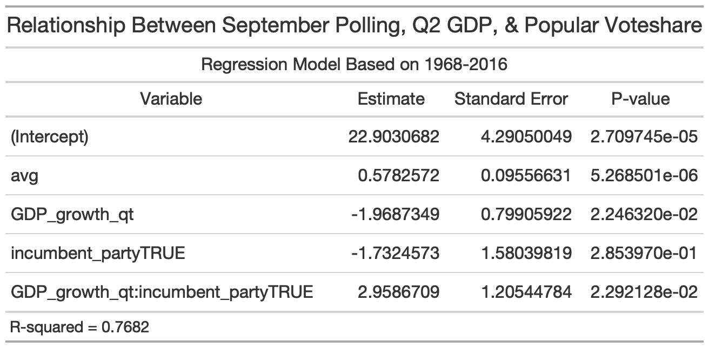
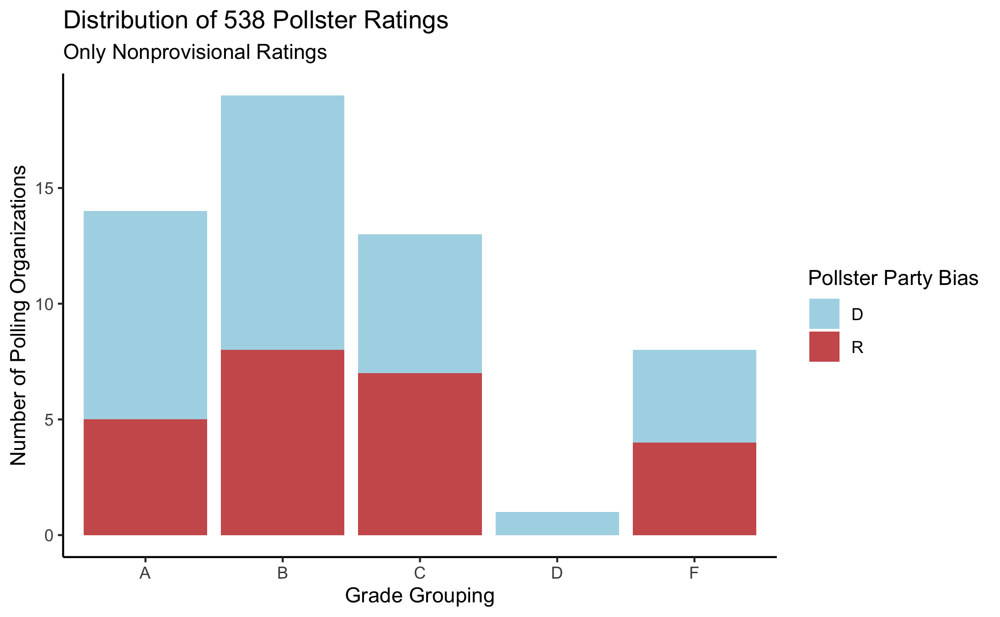

# Polling
## September 26, 2020

### Introduction
After Donald Trump's surprise victory in 2016, many Americans lost confidence in polling as a reliable predictor of presidential elections. While they are certainly imperfect, polls are often the best predictor available in advance of an election. This is especially true of polling that takes place closer to the date of the actual election [(Gelman and King, 1993)](https://hollis.harvard.edu/primo-explore/fulldisplay?docid=TN_cdi_gale_infotracacademiconefile_A14564056&context=PC&vid=HVD2&search_scope=everything&tab=everything&lang=en_US). There are plenty of [problems inherent in political polling](https://www.newyorker.com/magazine/2020/03/09/the-problems-inherent-in-political-polling), from non-response bias to inaccurate weighting, but as we learned from last week's exploration of fundamentals-only prediction models, approaches to predicting election outcomes that don't rely on polling at all are hardly perfect either.

### Ensemble Models
Last week, we examined the relationship between election outcomes and three different economic indicators: quarter 2 GDP growth, real disposable income growth, and change in the unemployment rate. The first and third indicators did have a statistically significant effect on election outcomes. However, the "best" of these models only had an R-squared value of 0.326, meaning it explained about 32.6% of the variation in the actual dataset. 

Most credible presidential forecasting outlets, [including 538](https://fivethirtyeight.com/features/how-fivethirtyeights-2020-presidential-forecast-works-and-whats-different-because-of-covid-19/), don't rely exlusively on either polls or fundamentals, economic and otherwise. 538's model is certainly more comprehensive, but here we'll explore how an "ensemble model" can have greater explanatory and predictive power. This regression model includes average polling numbers from September (the most recent full month of polling numbers available in 2020) and an interaction term between a candidate's incumbent party status and Q2 GDP growth. Q2 GDP growth, as we explored last week, appears much more likely to be credited to an incumbent party candidate that a non-incumbent party candidate, so its effect will not be the same depending on a candidate's affiliation.

This model has an R-squared value of 0.7682, which is far stronger than any of last week's fundamentals-only models. Using leave-one-out validation for 2016, it predicted that Hillary Clinton would win **46.45%** of the popular vote and Donald Trump would win **45.85%**. Interestingly, this is actually a closer margin than the actual result of 47% for Clinton and about 45% for Trump. 

However, because fundamental indicators, especially Q2 GDP growth (or lack thereof) are so [historically bad](https://www.wsj.com/articles/coronavirus-slump-is-worst-since-great-depression-will-it-be-as-painful-11589115601), the prediction this model generates for 2020 is still fairly distorted. It predicts that Joe Biden will win about **70%** of the popular vote while Donald Trump will win about **36%**. 

## Pollster Quality
This model uses an unweighted average of aggregated polls, but not all polls are created equal. 538 assigns [different rankings](https://github.com/fivethirtyeight/data/tree/master/pollster-ratings) to different polling organizations, and there's quite a bit of variation. Perhaps predictably, most organizations hover around a B rating. A distribution, with letter grade gradations (i.e. B-plus vs minus) grouped, is displayed below. This figure includes a wide variety of polls, including those 538 has only assigned a "provisional" rating to because they have not conducted enough polls to receive an official rating.

The following distribution only assesses those polling organizations with a large enough poll sample for 538 to assign an official rating to. They are also colored by their historical bias in favor of each party. These are relatively balanced.

