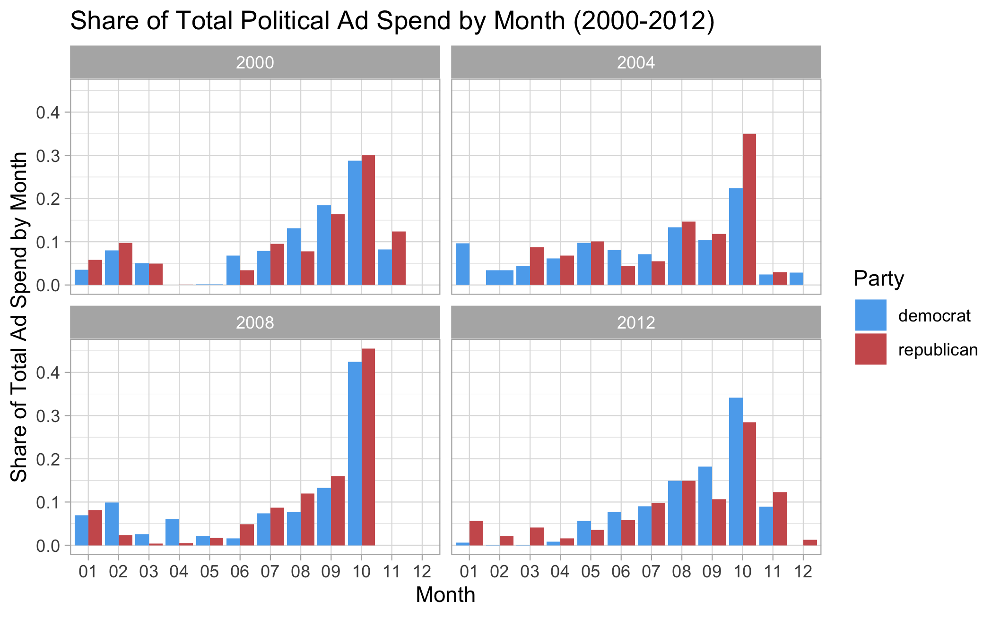
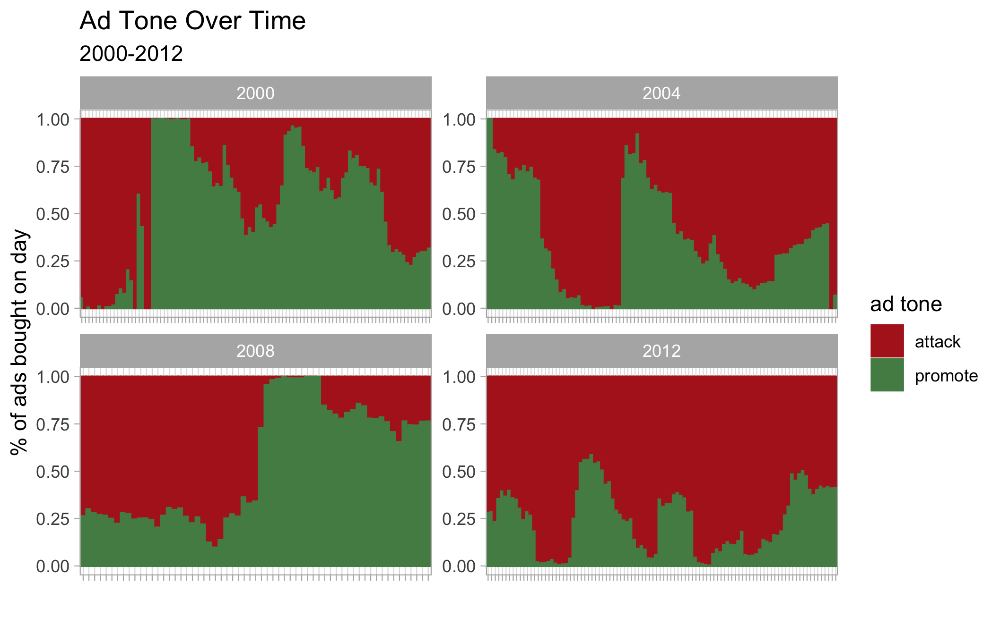

# Air Wars
## October 9, 2020

_**May the airtime be with you.**_

### Political Ad Campaigns
According to some projections, up to [$6.7 billion](https://www.nbcnews.com/politics/meet-the-press/blog/meet-press-blog-latest-news-analysis-data-driving-political-discussion-n988541/ncrd1207951) could be spent on political campaign advertisements in 2020 alone. 2020 is certainly a high-stakes election year which fuels both donations and advertisements, but it is hardly uncommon, especially in presidential election years, for ad spend to creep well into the billions. 

But even presidential candidates with [hundreds of millions](https://apnews.com/article/election-2020-joe-biden-donald-trump-elections-courts-396ce01a5545cc64b70575f523b93dd9) of dollars of cash-on-hand need to think carefully about how they spend it. How do candidates prioritize where and when to air political advertisements? What purpose does each ad serve? 

### Spending by month

When do campaigns prioritize investing in political advertising? When assessing the impact of TV ads on voter behavior [Gerber et al](https://hollis.harvard.edu/primo-explore/fulldisplay?docid=TN_cdi_proquest_miscellaneous_881466543&context=PC&vid=HVD2&search_scope=everything&tab=everything&lang=en_US) find that ads do have a strong effect on voter preferences, but those effects are relatively fleeting. The changes that ads make last only about a week or two before dissipating. Recency bias of some form among voters is becoming a recurring theme. We’ve also reviewed evidence suggesting that voters weight a president’s most recent term more highly than others. 

For presidential elections between 2000 and 2012 I assessed the relative share of total ad spending that each campaign spent each month. Given the context above and the disproportionate importance of the few weeks leading up to an election, the results are relatively unsurprising.

In all four election cycles observed, **ad spending shares increase as the election nears with the largest investments invariably coming in October** just before voters go to the polls. Campaigns spend an average of around 30% of their entire advertising budget just in October. Notably, some of the most famous political advertisements adhere to this trend as well. The iconic Daisy advertisement credited with being pivotal during LBJ’s reelection campaign, and reshaping the entire political advertising landscape, aired only once [the day before the general election](https://www.smithsonianmag.com/history/how-daisy-ad-changed-everything-about-political-advertising-180958741/) in 1964.

### Ad Tone

**Over Time**

Total spend isn’t the only element of advertising that campaigns have to budget over time. They also need to determine when to deploy different types of messaging. 

When examining the relative share of promotional vs. attack ads through presidential elections between 2000 and 2012, it becomes clear that there are relatively few consistent trends. The primary constant is that there is a lot of fluctuation and it is often fairly drastic. Swings from periods that are largely promotional to largely attack-oriented are usually not gradual. This seems to indicate that events or revelations fairly unique to each campaign have the power to swing advertising messaging quite starkly.

**By Ad Purpose**

Does tone vary significantly depending on the purpose of the advertisement? I examined the share of political advertisements that attack, contrast, or promote grouped by the following political ad purposes: personal, policy, both, and unclear. 

The results will be somewhat heartening to those who think political advertising is mostly attack-oriented. Attack messages are most highly concentrated in policy-focused ads but are not the primary message in any category. The only category in which the primary tone is not contrasting is the personal category where it is promotion. 

