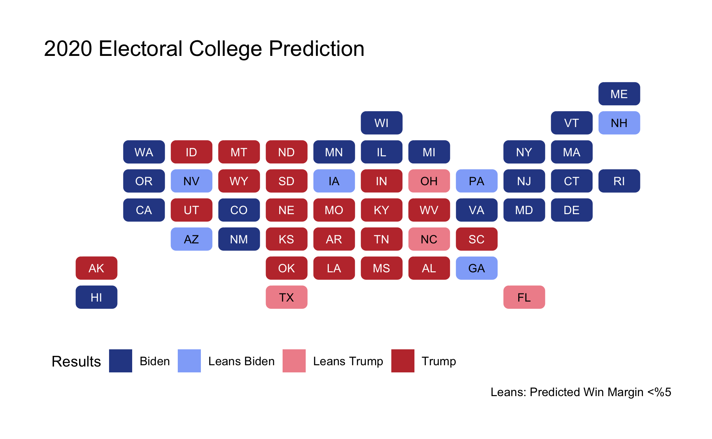

# Final Prediction
## November 1, 2020

[**Appendix**](final_appendix.md)

### Prediction

Using a model based on polling, demography, and incumbency, I predict that **Joe Biden will win the 2020 presidential election with 312 electoral college** votes to Donald Trump’s 226. In ten states, with a collective 163 electoral college votes (more than enough to tip the balance of the election) the difference in predicted vote shares between the two candidates is less than 5%, within the margin of error. 

State-by-state predictions roughly parallel [aggregated forecasts](https://www.270towin.com/maps/consensus-2020-electoral-map-forecast). In this forecast, some notable results include the following: Biden wins Georgia, Iowa, and most of the Rust Belt but Trump picks up Florida, Ohio, and North Carolina (incredibly narrowly). To see state-by-state vote shares, see the [appendix](final_appendix.md). 

## Model Overview
For each party, I created a weighted ensemble of two linear regression models to predict state-by-state two-party vote share using data from elections between 1976 and 2016 (demographic variables were available starting in 1988).

**Model 1:** ``lm(party_pv2p ~ state + party_polling + incumbent, data = full)``

The first model incorporated the following independent variables:

- _**Weighted candidate polling average from September and October.**_ I used polling data from [FiveThirtyEight]( https://data.fivethirtyeight.com/), current as of 2pm ET on October 29. Ideally, I would have just used October polling because polling numbers closer to an election date are far more predictive, but data available from credible pollsters (i.e. not [banned](https://projects.fivethirtyeight.com/pollster-ratings/) by FiveThirtyEight) only included numbers for 40 states. As such, I included September polling to cover the entire country. I created a weighted average for each state weighting proportionally based on sample size.

- _Incumbency Term_  
- _State Term_ to calibrate for historical voting behavior by state

**Model 2:** ``lm(party_pv2p ~ change*White, data = full)``

The second model incorporated the following independent variables:

- **Change in non-white (POC) population** share (percentage) since the previous presidential election
- *White population share**
- **Interaction term** between POC population change and White population

**Weighting**

I weighted the two models based on their R^2 values (what Nate Silver does for FiveThirtyEight’s election forecast, according to the Election Analytics Glossary™). The weights varied slightly by party, but hovered around an 85-90% weight for Model 1 and a 10-15% weight for Model 2. 

### GTs

