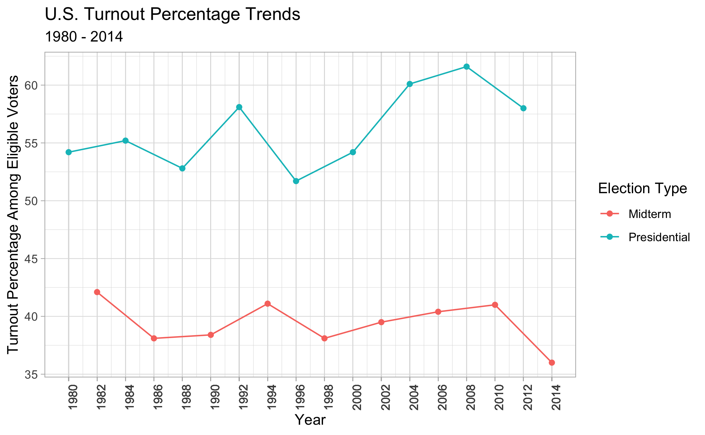
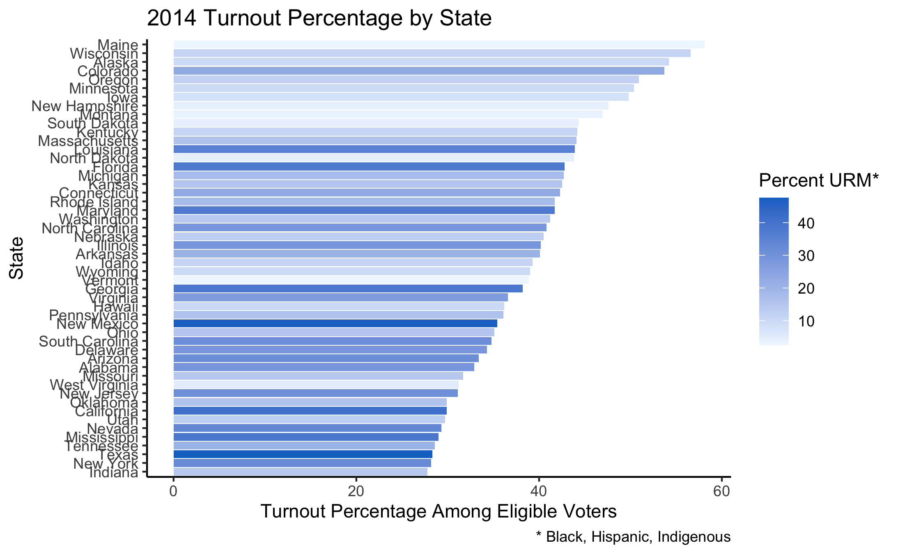
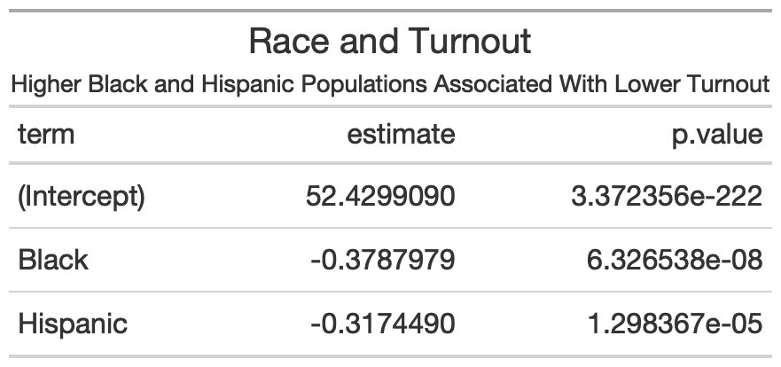
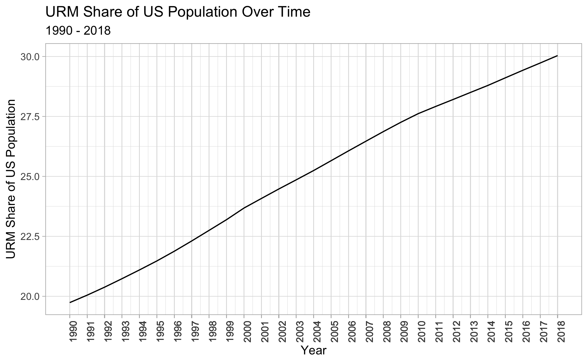
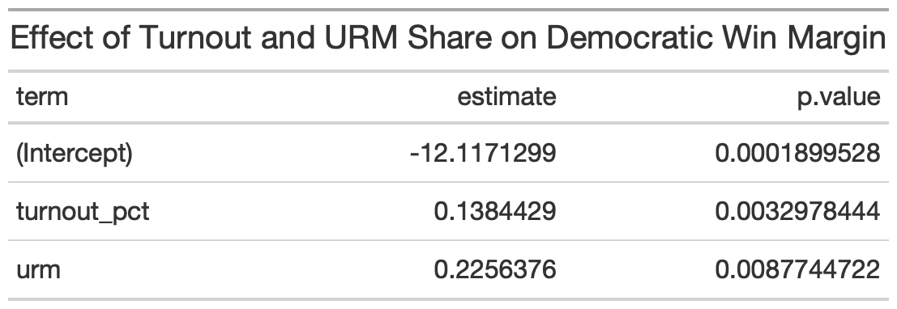

# Demographics and Turnout
## October 17, 2020

### Introduction
We’ve learned over the past few weeks that campaigns sometimes have more power to mobilize voters and increase turnout than they do to persuade them of a certain political ideology. When people think about what factors influence election outcomes, overall public opinion is probably the first that comes to mind. But when less than half of eligible voters go to the polls even during national-level elections, it’s worth bearing in mind that turnout might be even more decisive. How many people turn out to vote? Who are they? And whom do they vote for?

### Turnout Over Time

The US is home to about [233 million eligible voters](https://www.pewresearch.org/2020/09/23/the-changing-racial-and-ethnic-composition-of-the-u-s-electorate/) but far fewer than cast a ballot in the typical election 

Between 1980 and 2014, **the average turnout for a presidential election was 52% and the average turnout for a midterm election was 42%**. This is consistent with the general trend that higher profile elections generate more attention and discourse which is associated with higher turnout. There has been some fluctuation in turnout since 1980, with a spike in 2008 during Obama’s first campaign, but no distinct trends over time apart from the clear pattern that midterm elections mobilize fewer voters.

2020, however, likes to be an outlier. Experts anticipate [record turnout](https://www.brookings.edu/blog/fixgov/2020/08/14/election-2020-a-once-in-a-century-massive-turnout/) as polling suggests that a record number of Americans consider the results of this election to be of great importance. Increased VBM and early voting access which theoretically make it easier to vote also play a role. 

### Turnout by State

### Democrats and Demographics

