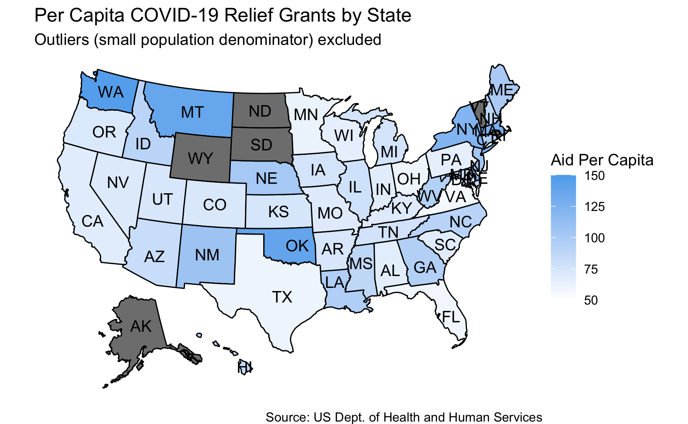

# Incumbency
## October 3, 2020

### Does Incumbency Matter in Elections?
Since 1980, [incumbent reelection rates](https://www.opensecrets.org/elections-overview/reelection-rates) in the House and Senate have rarely fallen below 80%. And the so-called ‘incumbent advantage’ gets even stronger further down the ballot in smaller state and local races. At the presidential level, less than a quarter of incumbents have failed to win reelection if they sought it. Generally speaking, a bet in favor of the incumbent has pretty good odds. 

But studies have shown that all else equal, voters care little about incumbency in and of itself [(Brown, 2014)](https://www-cambridge-org.ezp-prod1.hul.harvard.edu/core/services/aop-cambridge-core/content/view/ECFE39E003912F8AF65C2AD14A34BD8C/S2052263014000062a.pdf/div-class-title-voters-don-t-care-much-about-incumbency-div.pdf). So what gives incumbent candidates their seemingly enormous advantage? One notable advantage is name recognition, particularly in down-ballot races where opposition candidates might not get a lot of organic press. Incumbents can also literally start ahead in the race and functionally begin campaigning for reelection the moment they enter office. An opposition candidate might not file to run until years later. Both of these advantages also translate into [fundraising dollars](https://www.opensecrets.org/elections-overview/incumbent-advantage). 

### Impact of Federal Grant Spending
Finally, depending on the office, incumbents can also allocate spending in a way that appeals to voters. [Kriner and Reaves (2015)](https://hollis.harvard.edu/primo-explore/fulldisplay?docid=TN_cdi_proquest_journals_1018073231&context=PC&vid=HVD2&search_scope=everything&tab=everything&lang=en_US) examine the impact of federal spending in presidential elections. They find that at the county level, increases in federal grants are associated with increases in incumbent vote shares, particularly in competitive states. 

A simple model assessing the impact of increases in federal spending on incumbent vote shares at the county level, with a term for the interaction between spending and state competitiveness, yields the following results. 

**These results confirm that voters do appear to reward incumbents when their counties receive additional federal funding.** At the county level, for every one percent increase in spending, incumbents receive an additional 0.48 points when they seek reelection. This more than doubles to 1.12 points in competitive states. Given that Donald Trump won Michigan by [0.23%](https://www.nytimes.com/elections/2016/results/michigan) in 2016, it’s not difficult to imagine how federal spending, deployed strategically, could fundamentally alter the course of an election. 

It seems like some politicians already know this. By and large presidents employ a strategy known as ‘electoral particularism’ that entails funneling more federal dollars to electorally competitive areas. On average, swing states receive around 30% more federal funding than noncompetitive core states, and experience a bump during election years [(Kriner and Reaves, 2015)](https://www.cambridge.org/core/journals/american-political-science-review/article/presidential-particularism-and-dividethedollar-politics/962ABE4FC41A6FF3E1F95CE1B54D1ADD). 

### COVID-19 Relief Allocation
In response to COVID-19, the federal government rolled out a financial relief effort of [historic proportions](https://www.npr.org/2020/03/25/818881845/senate-reaches-historic-deal-on-2t-coronavirus-economic-rescue-package). Given the impact federal spending can have on county attitudes towards incumbents, and the historic trend towards electoral particularism, it’s interesting to see how grants have been apportioned based on data from the [Department of Health and Human Services](https://taggs.hhs.gov/coronavirus). 

| Total |
:-----:|
| |

While a number of [key swing states](https://www.politico.com/news/2020/09/08/swing-states-2020-presidential-election-409000) including Florida, Georgia, Michigan, North Carolina, Pennsylvania and Wisconsin have received noticeably more funding than the average state, they have also been legitimately [hard-hit](https://www.nytimes.com/interactive/2020/us/coronavirus-us-cases.html#:~:text=The%20places%20hit%20hardest,identified%20more%20than%20700%2C000%20cases.) by COVID-19. Furthermore, federal funding seems more evenly distributed when visualized based on spending-per-capita. 

| Per-Capita |
:---:|
||

### Implications for 2020
Given the economic distortions of the 2020 race, predictive models that factor in fundamentals will overly penalize Trump. This is true of most of the models I have created thus far, which have him losing in double-digit landslides, and I suspect it is also true of the [Economist’s model](https://projects.economist.com/us-2020-forecast/president) which puts some weight on economic indicators. 

Federal grant spending this cycle is also unlikely to be particularly informative in determining election outcomes. Basically any county affected by COVID (so, most of them) experienced a large increase in federal cash infusions compared to previous years. There are a number of reasons voters are less likely to reward President Trump for federal grant spending this year compared to others. In a normal year, grants would typically add something positive to constituencies. This year, they serve a harm mitigation role. While a voter might reward an incumbent for making her life better, she might not be so inclined if he is just making her life less worse. 

It is tough to say how much other facets of the incumbent advantage will help Trump this cycle. Joe Biden is a highly visible national figure and has [out-fundraised Trump](https://apnews.com/article/election-2020-joe-biden-donald-trump-elections-courts-396ce01a5545cc64b70575f523b93dd9) by a wide margin. Trump did literally file to run for reelection the day he was inaugurated, but the structural advantages of beginning a campaign early mostly have to do with visibility and money anyways. Plus, as we’ve learned, voters are human and humans have recency bias. 

Polling isn’t perfect, but especially in this race, it is probably the most predictive instrument we have. Based on [current poll aggregates](https://projects.fivethirtyeight.com/2020-election-forecast/), Biden will receive just north of 50% of the vote and President Trump will receive about 45%. 
