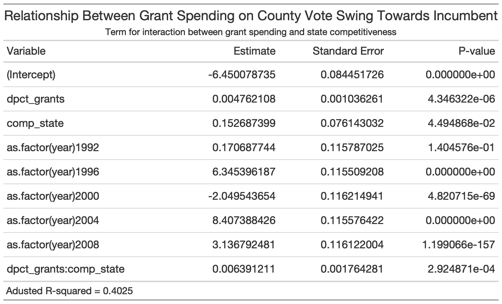

# Incumbency
## October 3, 2020

### Does Incumbency Matter in Elections?
Since 1980, [incumbent reelection rates](https://www.opensecrets.org/elections-overview/reelection-rates) in the House and Senate have rarely fallen below 80%. And the so-called ‘incumbent advantage’ gets even stronger further down the ballot in smaller state and local races. At the presidential level, less than a quarter of incumbents have failed to win reelection if they sought it. Generally speaking, a bet in favor of the incumbent has pretty good odds. 

But studies have shown that all else equal, voters care little about incumbency in and of itself [(Brown, 2014)](https://www-cambridge-org.ezp-prod1.hul.harvard.edu/core/services/aop-cambridge-core/content/view/ECFE39E003912F8AF65C2AD14A34BD8C/S2052263014000062a.pdf/div-class-title-voters-don-t-care-much-about-incumbency-div.pdf). So what gives incumbent candidates their seemingly enormous advantage? One notable advantage is name recognition, particularly in down-ballot races where opposition candidates might not get a lot of organic press. Incumbents can also literally start ahead in the race and functionally begin campaigning for reelection the moment they enter office. An opposition candidate might not file to run until years later. Both of these advantages also translate into [fundraising dollars](https://www.opensecrets.org/elections-overview/incumbent-advantage). 

### Impact of Federal Grant Spending
Finally, depending on the office, incumbents can also allocate spending in a way that appeals to voters. [Kriner and Reaves (2015)](https://hollis.harvard.edu/primo-explore/fulldisplay?docid=TN_cdi_proquest_journals_1018073231&context=PC&vid=HVD2&search_scope=everything&tab=everything&lang=en_US) examine the impact of federal spending in presidential elections. They find that at the county level, increases in federal grants are associated with increases in incumbent vote shares, particularly in competitive states. 

A simple model of this relationship yields the following:

### COVID-19 Relief Grants

| Total |
:-----:|
| |

| Per-Capita |
:---:|
||

