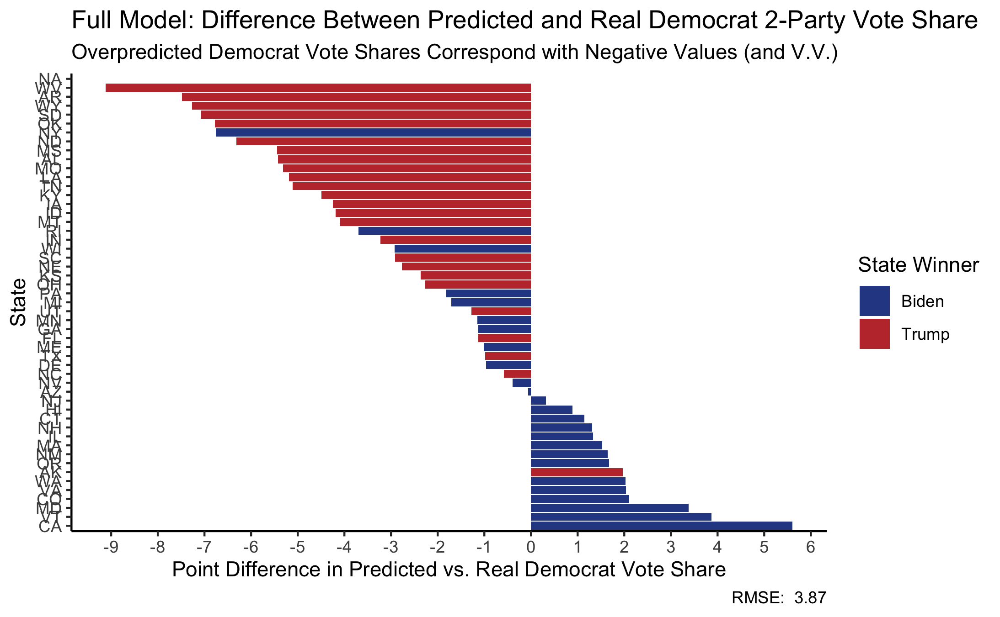
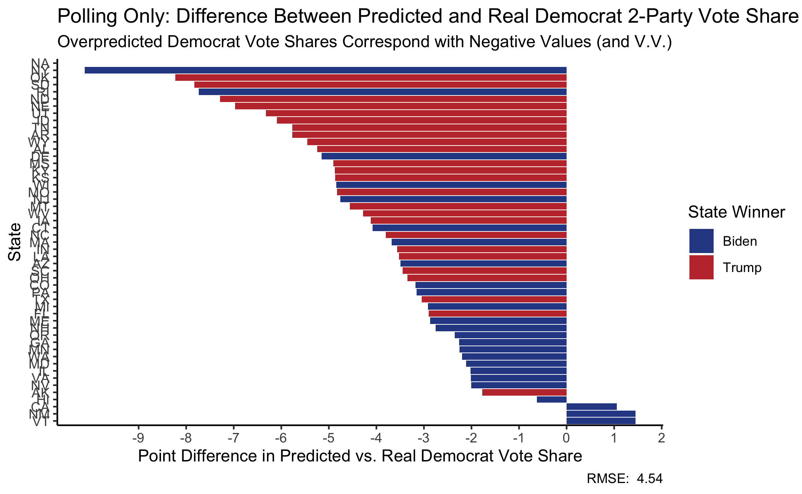

# Post-Election Reflection
## November 24, 2020

For [my last blog post](final_prediction.md) I built a model based on polling, demography, state voting history, and incumbency to predict state-by-state two-party vote share in the 2020 Presidential Election. I predicted that Joe Biden would win the presidency with 312 electoral college votes to Donald Trump’s 226. 

In terms of Electoral College results, this model did pretty well. **It accurately predicted every state but Iowa**, and overpredicted Biden’s electoral college margin by the state’s six votes. (Notably, I did not split districts in my predictions for Maine and Nebraska, though ME-2 and NE-2 ended up cancelling each other out.) 

Notably, this model **correctly predicted outcomes in all three of North Carolina, Florida, and Georgia**. Admittedly, I was highly skeptical of this prediction when I first saw it. I was not surprised by each individual state’s outcome, but by the fact that of these three states, Georgia was the _only_ one predicted to go for Biden. Frankly, my personal intuition (which [FiveThirtyEight](https://projects.fivethirtyeight.com/2020-election-forecast/) agreed with) was that Georgia was _least_ likely to cast its electoral votes for a Democratic candidate. Apparently my model was less susceptible to my own personal priors.

### Accuracy and Error

Electoral college outcomes were only a product of this model’s prediction. Its primary objective was to predict two-party popular vote share by state. Here, there was plenty of error outside of Iowa. **The root mean squared error (RMSE) between predicted and real two-party popular vote share was 3.87 points.** Visualizing the error by state yields the following:

The values in this graphic were generated by subtracting predicted from real Democrat two-party vote share, so negative values represent overprediction in favor of Biden, and positive values represent overprediction in favor of Trump. On average, my model was overly kind to Biden and **overpredicted Democrat vote shares by 1.92 points**. In only 15 states did my model predict that Trump would receive a higher vote share than he actually did. 

Most of the states where my model overpredicted Democrat vote shares ended up going for Trump, and vice versa. This indicates that by and large, **most error came from underpredicting how strong the favored candidate’s lead was**. Put more cynically perhaps, my model underestimated how [polarized](https://www.pewresearch.org/fact-tank/2020/11/06/2020-election-reveals-two-broad-voting-coalitions-fundamentally-at-odds/) results would be and anticipated closer state-wide races than there actually were.

### Sources of Error

Error in state-level two-party popular vote share seems to come in large part from polling error. **The RMSE between weighted polling averages and actual outcomes (party pv2p) is 4.54**, about 17% higher than the RMSE for the full model. Most of this error comes from overpredicting Democrat vote share even more. **A polling-only approach overpredicts Democrat vote shares by 3.9 points** on average. This is nearly double the Democratic skew in my full model. Visualizing polling error by state underscores this bias:

_**Excluding demographics**_

Interestingly, **my model’s two-party popular vote share actually would have been slightly more accurate had I left out demographic analysis**. The RMSE for a model based just on polling, state voting history, and incumbency would have been 3.6, with a Democrat skew of 1.89 points. Demographic shifts in the US do tend to favor Democrats, and since most error came from overpredicting Biden’s vote share, omitting that from the model brings us closer to the actual result, whether or not this variable was actually the primary source of error.

**_The error behind the error_**

“Polls in 2020 favored Democrats” is probably the coldest take since “polls in 2016 favored Democrats”. It’s very clear that pollsters, despite their [best efforts](https://fivethirtyeight.com/features/what-pollsters-have-changed-since-2016-and-what-still-worries-them-about-2020/) have not been able to totally crack the problems of 2016, or perhaps new problems have arisen. 

There are [myriad possible explanations](https://www.nytimes.com/2020/11/10/upshot/polls-what-went-wrong.html) for what went wrong. While pollsters made meaningful changes to methodology in the wake of the 2016 election, it seems other unforeseen sources of error complicated predictions. In 2016, polls underweighted white, non-college educated voters. Weighting appears to have been more accurate in 2020, but polling numbers themselves among this demographic were not. It seems polling also overpredicted Biden’s lead with seniors, often heavily.

If this is true, it’s a deeper problem than 2016 where demographic partisan predictions were much more accurate, even if weights were not. Now, polling figures among certain demographics seem to be less reliable. 

The [New York Times](https://www.nytimes.com/2020/11/10/upshot/polls-what-went-wrong.html) offers the following possible explanations:

- **The Shy Trump Hypothesis:** polls don’t reach Trump voters and/or Trump voters do not tell pollsters the full story
- **Coalitional Shifts:** over the past four years, perhaps Trump gained support among those less likely to respond to polls, and lost support among those more likely (i.e. college educated populations)
- **Turnout:** Trump turned out non-voters who tend to be underrepresented in the polls and/or Republican turnout was just higher than predicted
- **COVID-19:** pre-pandemic polling looks more accurate than recent polling. One theory goes that people who tend to take political surveys (who skew Democrat) started taking a lot more of them once they were stuck at home during the pandemic.
- **Hispanic Voters:** here, polls were _way_ off. The sample size of Hispanic voters in a given survey tends to be incredibly low, perhaps distorting predictions.

Some of these factors can be quantitatively tested. When final data is available, we can see how many typical nonvoters turned out, and how Republican turnout compared to Democrat turnout. Some of these factors, however, basically rely on certain assumptions about the demographics and partisan preferences of people who do and don’t respond to polls. We have plenty of fairly reliable information about folks who do respond to polls, but less about those who don’t, for exactly that reason. There are, however, conclusions we can draw about final differences between polling figures and real figures, and where the major sources of error were.

## Iowa

Interestingly, in the one state where my model wrongly predicted the electoral college outcome, polling numbers actually came closer to the actual result than either my full model, or the model excluding demographics. In fact, while demographics on average pushed predictions to the left making my full model less accurate, in Iowa they pushed it to the right. The error breakdown is as follows (all error overly favors Joe Biden):

- **Full model:** 4.25 points off
- **Model 1 only (no demographics):** 4.42 points off
- **Polling only:** 4.12 points off

Iowa has generally [leaned blue](https://www.270towin.com/states/Iowa) in presidential elections since 1976, and since my model incorporated historical popular vote share, that would have pushed predictions in favor of Biden. 

As for why demographics and demographic change favored Republicans in Iowa, the [US Census Bureau](https://www.census.gov/quickfacts/IA) finds that Iowa is 90.6 percent “White alone” (i.e. non-Hispanic Whites). 

### Lessons Learned

If I were to change my model, I would probably do the following:

- **Incorporate state-by-state partisan tendencies using just the previous election**, instead of longer histories. I still believe in the predictive power of past elections, but especially for states like Iowa where there have been shifts over time, the most recent election is probably more predictive than a calibration term based on historical tendencies.
- **Remove demographic considerations.** To be clear, I think this model is statistically significant and says really useful, predictive things about the relationship between demographics and two-party vote share. Transparently, I made some choices when designing this model that were very much about dampening Biden’s lead because I suspected (for mostly irrational reasons that bore themselves out) that polling leaned too far left. This choice would fall into that category.
- **Incorporate a 2016-sized polling error.** There basically was one. This is a bit of a blunt instrument, but if in hindsight polling had problems of a similar magnitude compared to 2016, this feels like the simplest way to correct for that. 
