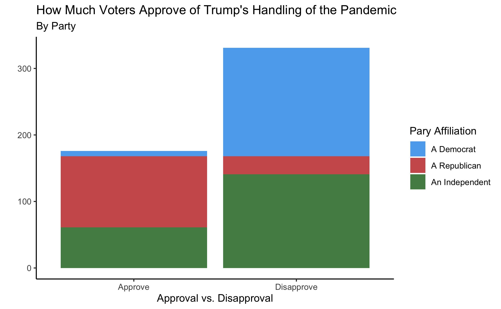
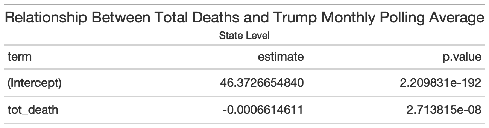
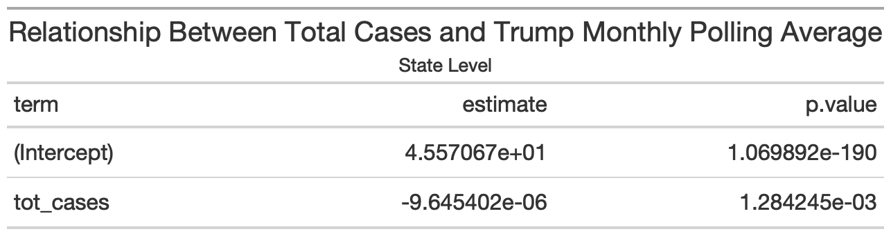
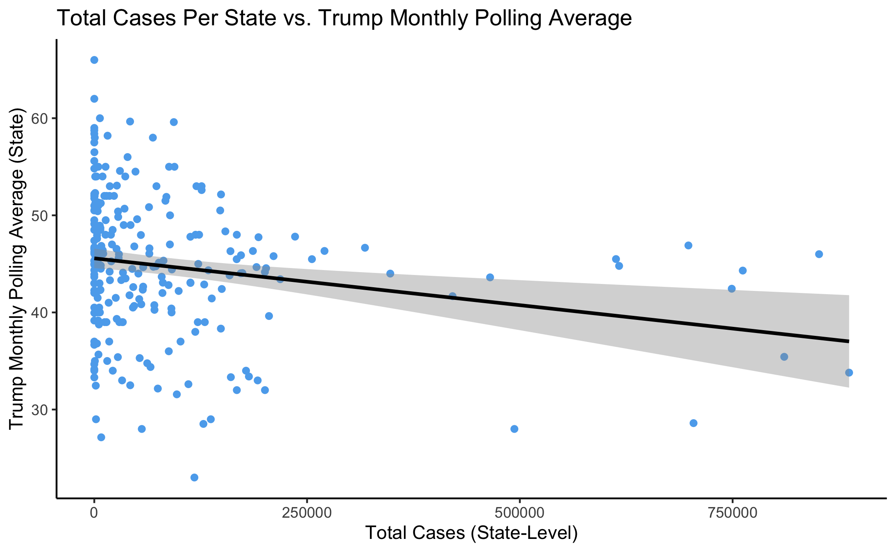
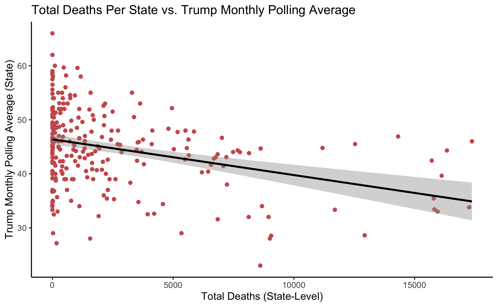

# Shocks
## October 24, 2020

We know fundamentals aren’t the only factors that influence elections. Partisanship, political cycles, campaigns, and a host of other factors play a role in determining who comes out on top on election day. Electoral politics and predictions are always complicated, but as everything else, they seem 10x more complicated in 2020. Shocks and calamities, political and otherwise, play a noticeable role in election outcomes. [Research suggests](https://hollis.harvard.edu/primo-explore/fulldisplay?docid=TN_cdi_proquest_miscellaneous_59783343&context=PC&vid=HVD2&search_scope=everything&tab=everything&lang=en_US)  that state-level deaths resulting from the war in Iraq significantly depressed incumbent vote shares (Karol & Miguel, 2007). Natural disasters like [tornados](https://hollis.harvard.edu/primo-explore/fulldisplay?docid=TN_cdi_crossref_primary_10_1561_100_00009057&context=PC&vid=HVD2&search_scope=everything&tab=everything&lang=en_US) can also influence outcomes (Healy, 2010). 

While research suggests that even shocks beyond policymaker control, like [shark attacks](https://hollis.harvard.edu/primo-explore/fulldisplay?docid=TN_cdi_crossref_primary_10_1086_699244&context=PC&vid=HVD2&search_scope=everything&tab=everything&lang=en_US), can cause voters to irrationally penalize incumbents, results from those studies have been difficult to replicate and have limited external (and internal) validity (Fowler and Hall, 2018). And even seemingly apolitical shocks like tornados only affect incumbents when policy responses are lacking. 

Arguably the biggest shock of 2020, and its election cycle, is COVID-19. It remains to be seen whether the pandemic, and the Trump administration’s response, will actually lead Americans to fire the incumbent, but they have certainly made the race more complicated and difficult for the president

### Pandemic Partisanship 

**The political effects of the pandemic are not evenly distributed.** Based on the [most recent](https://ropercenter.cornell.edu/ipoll/study/31117693) available polling, about 34% of Americans approve of the Trump Administration’s handling of the pandemic, with about 65% disapproving. However, **approval rates vary wildly by political affiliation.** Independents roughly match overall numbers, with about 30% approving and 70% disapproving. Meanwhile, only 5% of Democrats approve of pandemic handling (95% disapprove), while only 20% of Republicans disapprove (80% approve). While the asymmetry in the inverse trend among Republicans and Democrats is notable, the partisan divide is aggressive.

### Death and Polling

There is a statistically significant relationship between total deaths per state and statewide polling. **Higher total COVID deaths by state seem are associated with lower polling numbers for President Trump**. Data suggest that Trump loses an average of 0.0006615 points in a given state for every additional COVID-related death.

There is also a statistically significant relationship between total _cases_ per state and statewide polling. **Higher total COVID cases by state seem are associated with lower polling numbers for President Trump**. Data suggest that Trump loses an average of 0.0000009645 points in a given state for every additional COVID-related death.

These numbers seem small, but in states with thousands of deaths, tens of thousands of cases, and razor thin margins of victory, they could certainly make a difference. 

### Implications for 2020

It is unlikely that electoral results in 2020 will exactly map to approval ratings of pandemic handling. However, those sentiments will certainly play a role. [FiveThirtyEight](https://projects.fivethirtyeight.com/coronavirus-polls/) finds that about 30.4% of Americans are "Very Worried" about the pandemic. 35.5 are "Somewhat Worried" while 31% are "Not very" or "Not at all" worried. 

Interestingly, a prediction of Trump's popular vote share that equally weights pandemic approval ratings with the average incumbent two-party popular vote share between 1948 and 2016 (52.7%) would have Trump winning 43.35% of the popular vote which is highly plausible. It is tough to completely accurately guage how voters weigh different issues in the pandemic. A prediction based on the idea that the pandemic accounts for about half of a voter's decision while the remainder of factors are standard to a typical election is fairly crude. But given the circumstances, I would certainly trust this prediction over many traditional predictors including fundamentals only models.
