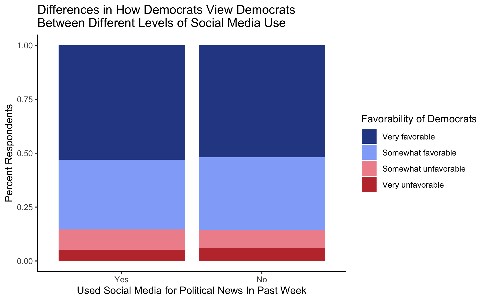
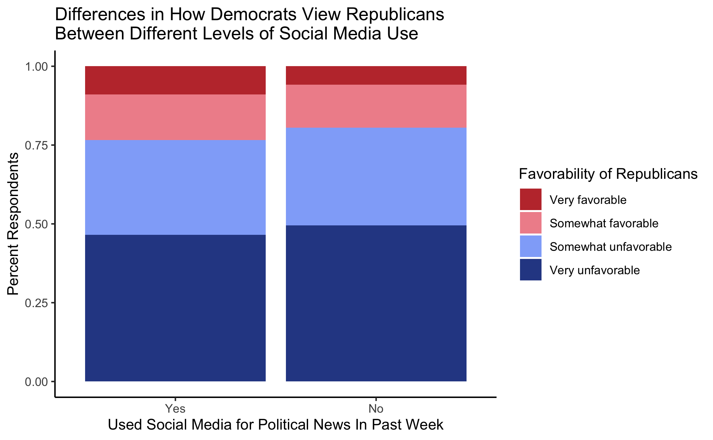
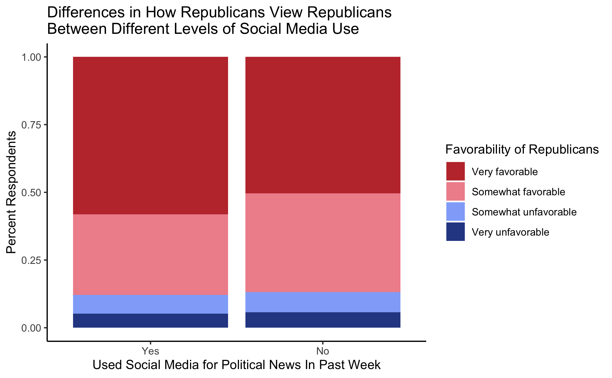
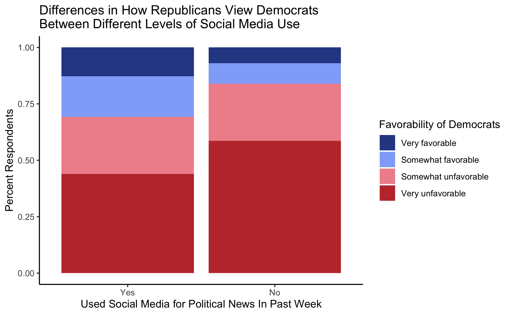

# Testing Election Narratives: Social Media and Polarization
## December 10, 2020

Since its inception, the role of social media in the modern political landscape has become increasingly significant and controversial. Social media use has grown exponentially over the past decade and a half. In 2005, only 5% of US adults used social media. By 2019, that number had grown to nearly [80%](https://ourworldindata.org/rise-of-social-media). Politics has responded to this trend, with [both Trump and Biden’s presidential campaigns](https://abc7.com/presidential-race-campaign-spending-trump-political-ads-biden/7452228/) setting records for social media ad spending in 2020. Its rapid rise has also been disruptive, and it is no wonder that there is substantial discourse around how social media affects day-to-day life, interactions, and of course, politics.

One key narrative about the effect that social media has on politics revolves around its power to polarize. Social media algorithms can create [“filter bubbles”](https://www.vox.com/recode/21534345/polarization-election-social-media-filter-bubble) where people on platforms overwhelmingly see content from other members and pages that share views similar to their own. [Centralized echo chamber networks](https://www.scientificamerican.com/article/why-social-media-makes-us-more-polarized-and-how-to-fix-it/) in particular can amplify partisan bias, or so the story goes. There is also [evidence](https://www.pnas.org/content/115/37/9216) that exposure to opposing political views, particularly the kind that exist on social media, can actually increase polarization. 

And it is true that American politics has become substantially more polarized over the course of the past few election cycles. Time even [went so far](https://time.com/5907318/polarization-2020-election/) as to say that “polarization is the only clear winner” of the 2020 presidential election. Deepening political divides have roughly coincided with the rise of social media. Relatively few would claim that social media has been solely responsible for this trend, but what role does it play?

### Testable Implications

If it is true that being exposed to echo chambers and more polarized content on social media deepens political divides, we would expect to see more polarized political opinions from people who rely more heavily on platforms like Facebook and Twitter to get their political news. [Nationscape](https://www.voterstudygroup.org/nationscape) a large public opinion survey conducted in 2020, asked a couple of questions that could help test that hypothesis. 

To approximate the importance of social media in each respondent’s political news consumption habits, the survey asked if they had seen or heard political news on social media platforms like Facebook or Twitter in the past week. While the majority (4760) had, a sizeable share (1809) had not. 

The survey also asked about each respondent’s personal political party affiliation, and asked that they share whether they viewed Republicans and Democrats: very favorably, somewhat favorably, somewhat unfavorably, or very unfavorably. The strength with which a respondent views their own or the opposing party favorably or unfavorably can act as a proxy for how polarized their political perceptions are. 

Evidence in support of the notion that receiving political news from social media increases polarization at the individual level would look like this:
- More unfavorable views of the opposing party among respondents who more regularly use social media to view political news
- More favorable views of their own party among respondents who more regularly use social media to view political news

### Preliminary Findings

This preliminary analysis **does not provide evidence in support of the narrative that social media use causes individuals to hold more polarized views.** 

_**Democrats**_

I first examined how respondents who identified as Democrats viewed their own party vs. the Republican party, between those who had and had not received political news through social media in the week prior to taking the survey.

As expected, Democrats view Democrats far more favorably than they view Republicans, but there is virtually no difference in perceptions of each party between those who did and did not use social media to access political news. Notably, there was a _very_ small but statistically significant difference in how Democrats viewed Republicans between social media groups. I coded each favorability response as an integer from 1-4 (1 being ‘very favorable’ and 4 being ‘very unfavorable) and ran a linear regression on the effect that social media use had. Those that had _not_ used social media in the previous week actually viewed Republicans _less_ favorably than those who had, by 0.13 points on the coded favorability scale (p-value = 0.0496). This difference is ever so slightly visible and actually runs counter to the notion that social media use would decrease Republican favorability among democrats

_**Republicans**_

I conducted the same analysis with Republican respondents with similar results.

There was no statistically significant difference in how Republican respondents viewed other Republicans between the two social media groups, but there was a statistically significant difference between how the two groups viewed Democrats. Again, these results do not support the idea that social media use would increase polarization and unfavorability towards the opposing party. Republicans who had used social media viewed Democrats more favorably. This effect was larger and more statistically significant than the corresponding result among Democrats.

### Implications and Limitations

These results seem to contradict at least the idea that using vs. not using social media makes a difference in how polarized someone’s political views are. There are a number of limitations to these findings. First, the survey only offered binary insight on whether respondents had or had not viewed political content through social media in the past week. The short timeframe and binary nature of the question limit how much insight can be collected about the spectrum of social media use and how different degrees might change political views. 

Social media’s impact on polarization also may lay more in how it changes the culture of journalism and political information overall. If this is the case, those effects would extend throughout the media landscape and also affect those who use social media less. This impact would not show up in this particular analysis. 

These results certainly don’t disprove the idea that social media has impacted polarization, but they do not provide evidence that individual-level social media use further polarizes perceptions of political parties.

